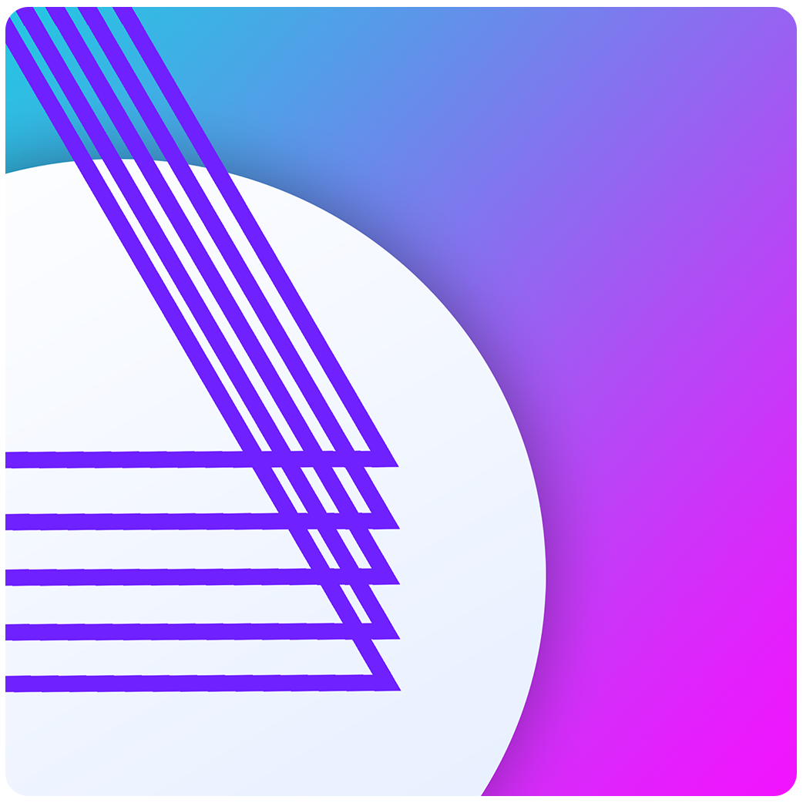

  
  <h1 align="center">Webments</h1>

Webments is a collection of components designed with scratch CSS using different design languages.

Warning: Work in Progress, do NOT use.

## Index

### glow.css
A glow design based framework.

### neumorphic.css
Neumorphic is a futuristic design metaphor and language.

### paper.css
A paper design based framework.

### shadow.css
A shadow design based framework.

### skeumorphic.css
A skeumorphic design based framework.

### flat.css
A flat design based framework.

### fluent.css
Fluent Design is Microsoft's design language.

### simplistika.css
Simplistika is <a href="https://github.com/mercode-org">Mercode's</a> design language.

### oneui.css
One UI is Samsung's design language.

## How to use

All frameworks are available for usage and customization on your own projects. You can obtain the styles from the CSS stylesheet of the design language you want to have and use them directly on your projects. The preview (html) page is also a kind of documentation to that design language. All used class names, customization options and all other necessary details are explained in them.

## Structure

The basic structure is based on repositories. Every repository contain the files for a single design language and a README file which briefly explains the design language and the files themselves.

### HTML folder

The HTML repository has the most basic style, using plain HTML and CSS styles and are the base file for other design languages. Other repositories use these files as base to themselves and updates made to the contents of this folder are also synced with other repositories (e.g. main.css).

## Word terminology

Web + Elements = **Webments**
